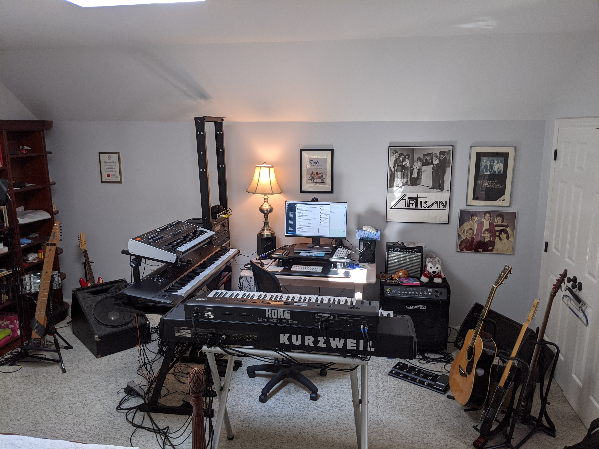

# Music

My first piano lesson was the day before my fifth birthday. I often combined
computers and music, like in my live performance software
[KeyMaster](https://github.com/jimm/keymaster). That program stems from an
older program I wrote called KeyMaster that I originally wrote on the
Commodore 64 and used on stage for years. I later ported it to the Atari ST
and rewrote it for the now-defunct
[BeOS](https://en.wikipedia.org/wiki/BeOS).

Currently, I play keyboards in [Ellis Island](http://ellisislandrock.com/).

I performed in [bands](#band-list) from 1980 to 1993, went on a hiatus, and
started playing out again in 2013. Over the years, I've played everything
from progressive rock to dance pop to electric jazz and R&amp;B; covers and
originals. Here's a video of
[Miles at Connelly's](https://www.youtube.com/watch?v=t5yU0mX-u4w) in Times
Square, New York City in 2013. I'm the guy with the beard and glasses off
at the side of the stage.

I write different kinds of stuff. Most of it is funk/dance/pop, but I also
dabble in orchestral, Sondheim-esque pieces, game show themes, thirty-second
newsroom background music, and whatever else tickles my fancy.

Aside from the typeset pieces below and the sequencer and MIDI files of the
music I've done on my own, I have thrown a few things up on Soundcloud for
the fun of it. Out of all of the original songs we did in the late '80's, I
only have one crappy cassette of a bunch of works-in-progress . It's dated
but really good stuff. The sound quality is horrendous. Also, the tape broke
so I'll need to repair it one day.

My MIDI reference has moved [here](midi_ref.html). It's not a tutorial.
Rather, it is intended as a quick overview and a reference guide.

# Compositions

Here are three pieces I composed that I've typeset using
[LilyPond](http://lilypond.org/web/).

- [Equal Rites Main Theme](music/main_theme_piano.pdf)
- [Equal Rites Number 3](music/equal_rites_3.pdf)
  - Recording is called [At Sea](https://soundcloud.com/jim-menard/at-sea)
    on Soundcloud
- [Mosquito Bite Rag](music/mosquito_bite_rag.pdf)

Here are a few others on SoundCloud:

- [Delicate](https://soundcloud.com/jim-menard/delicate) from Equal Rites
- [No Fences](https://soundcloud.com/jim-menard/no-fences-draft) (draft)
- [Solar Power](https://soundcloud.com/upload) (draft)

# Equipment Collection

Here's what my home "studio" looked like in late 2020. The Midiboard has
since moved on to another home and I've added the Alesis SR18.

## Equipment List

Here's a tech-head's view of the tools I use to create my music. 

- [Korg Kronos X 88](https://www.korg.com/us/products/synthesizers/kronos_x/)
- [ASM Hydrasynth](https://www.ashunsoundmachines.com/hydrasynth-key)
- [Korg Wavestation](https://en.wikipedia.org/wiki/Korg_Wavestation)
- A big honking seven-foot rack, affectionately called the "Think Tank".
  Most of the equipment in it was originally mounted in a homemade, rolling,
  chest-high rack of the same name, along with a Commodore 64 running my own
  real time MIDI performance software.
  - Kurzweil K2000RS (R = rackmount, S = sampling), the rackmount version of
    [this](https://en.wikipedia.org/wiki/Kurzweil_K2000)
  - [Kurzweil 1000PX](https://soundprogramming.net/synthesizers/kurzweil/kurzweil-1000px-professional-expander/)
  - [Mackie LM-3204](https://gearsource.com/stock-item/mackie-lm3204-16-stereo-channel-32-mono-console/)
    mixer
  - Emagic AMT8 MIDI interface
  - Korg DRV-2000 digital reverb
  - Crest Audio FA901 power amp
  - Two rack-mount power strips
  - Custom patch bay with 12 1/2", 6 MIDI, 4 XLR, 2 1/2" TRS
  - Sedna 13 port rack mount USB hub
  - Akai ME10D MIDI "digital delay" (echoes MIDI data, optionally
    transposing it up/down one octave)
- Alesis SR18 drum machine
- Yamaha MV802 mixer, which used to be in the Think Tank. I now use it live,
  so it's in a two-space rack gig bag.
- Fender Stratocaster
- Ibanez SR505 5-string bass
- [Chapman Stick](http://stick.com/), 12-string Grand Stick with 5 bass, 7
  treble strings; classic tuning
- [Moog Etherwave Theremin](https://www.moogmusic.com/synthesizers?type=54)
- [Akai MPD32](https://www.akaipro.com/mpd32) USB/MIDI pad controller
- Behringer U-PHORIA UMC404HD audio interface
- M-Audio MIDISPORT 4x4 Anniversary Edition 4-in/4-out USB MIDI Interface
- Yamaha U3 upright piano
- Apple MacBook Pro laptop
- Speakers:
  - A pair of M-Audio AV 40 monitors
  - JBL EON 515XT powered speaker
  - OAP T-122B wedge (70 lbs, a pain to carry around)
  - Home-made (by someone else) piece of crap
- Guitar/Bass Amps:
  - Line 6 LowDown LD400 Pro (2x10")
  - Fender Frontman 15R practice amp that I found at the town dump in
    full working condition
- On-Stage KS7365EJ Pro Heavy-Duty Folding-Z Keyboard stand
- Various Ultimate keyboard stands
- An Ultimate speaker stand
- Three empty six-space racks from the olden days of live performance
- Also hanging around
  - Ukelele
  - Mandolin
  - Yamaha FG830 Acoustic Guitar

## Live Setup

Here's what I use when I play live with [Ellis Island](https://ellisislandrock.com/).
Everything here is from the above equipment list.

- Kronos
- Hydrasynth
- On-Stage stand
- MV802 mixer
- JBL powered speaker
- SR18 (when two of us play small gigs only, not with the full band)
- Ibanez bass (only for the few gigs where I've had to sub for the bass
  player)

## Software List

- [REAPER](http://reaper.fm/) Digital Audio Workstation.

- [KeyMaster](https://github.com/jimm/keymaster/wiki), real-time MIDI
  performance software that I wrote. The first incarnation was also called
  [KeyMaster](projects/keymaster/index.html). I used that version live from
  1986&ndash;1993. It was first written for the Commodore 64, later ported
  to the Atari ST. I half-heartedly started a Macintosh version. The next
  was the BeOS version. For later instantiations see the cross-platform
  [PatchMaster](http://www.patchmaster.org/) and
  [keymaster_objc](http://jimm.github.io/keymaster_objc/), a Mac OS X-only
  simpler version.

- ASM's Hydrasynth Patch Manager and Firmware Updater
  ([download page](https://www.ashunsoundmachines.com/downloads))

- [MidiPipe](http://www.subtlesoft.square7.net/MidiPipe.html) MIDI munger.
  
- [Kronut](https://github.com/jimm/kronut), a set list slot text editor for
  the Kronos. It's software I wrote that lets me use my editor (Emacs) to
  edit set list slot titles and notes text.

- [Korg KRONOS Editor](https://shop.korg.com/kronosSupport)
  (link is to the KRONOS support/downloads page). I've had troubles using
  this editor; the design it uses for edit space / memory is extremely
  confusing and I've more often erased / ruined set lists than successfully
  edited them.

- Apple's [MainStage 3](http://www.apple.com/mainstage/) is useful when I
  play with friends. We rent a rehearsal room once a week or so, and though
  the keyboards are the same in the different rooms we rent it is nice to
  have the same sounds, splits, transposes, etc. with me on my laptop.

- [LilyPond](http://lilypond.org/web/) for music notation typesetting.

- [Sonic Pi](https://sonic-pi.net/), a code-based music creation and
  performance tool.

## Old Gear

Just for fun, here's a list of my old gear. I started playing in bands in
the late '70's, but here's what I remember:

- Alesis D4 drum synth
- Alesis HR-16
- Commodore SX-64 running first Moog's Song Producer software, then
  my KeyMaster software
- Conn trumpet
- Ensoniq Mirage rack-mount software (load sounds from 3.5&quot; floppies!)
- Farfisa organ
- Fender Rhodes
- Hohner International "electronic piano" (I think it was the International)
  from the late 1960's &mdash; my first keyboard after my parents' piano
- Korg CX3 organ
- Kurzweil Midiboard "Limited Edition"
- Moog Memorymoog
- Moog Song Producer
- Moog Source
- Opcode Studio 5 MIDI interface
- Roland AXIS-1 strap-on MIDI keyboard
- Roland Juno 106
- Roland MKS-80 SuperJupiter
- Studiologic Sledge 2.0
- Yamaha CP 70 electric grand (it was the singer's, but I got to use it)
- Yamaha CS-5 mono analog synth
- Yamaha DX7
- Yamaha RX5 drum machine
- Yamaha TX81Z (Two of 'em. You could set the text to display when they
  powered up. I had the two of mine say `Welcome to the` / `Think Tank!`)

# Band List

Here are the bands and orchestras I've played in over the years, in reverse
chronological order. Believe me, you've never heard of any of them.

- [Ellis Island](http://ellisislandrock.com/) (keyboards, occasional bass)
- [Miles...](https://www.youtube.com/watch?v=t5yU0mX-u4w) (keyboards)
- Uncommon Ground (keyboards)
- Optional Stop (keyboards)
- Boys With Toys (keyboards)
- Shy264 (keyboards)
- Perfect Stranger (keyboards)
- Artisan (keyboards)
- Sinequanon (keyboards)
- Guys and Dolls (conductor and music director, college)
- Camelot (conductor and music director, high school)
- King Lizard Revival Jass Band (trumpet, high school) _("Jass" is an early
  spelling of "Jazz")_
- Once Again (electric piano, trumpet, high school)
- Just Once (electric piano, trumpet, high school)
- All-State band, orchestra, jazz band in high school; One year, both
  orchestra (contrabass) and jazz band (electric piano)
- RI Youth Orchestra (contrabass, junior high, high school)
- Central Jr. High and East Providence High School concert and marching
  bands (trumpet)
- Starfire (electronic piano, junior high)
