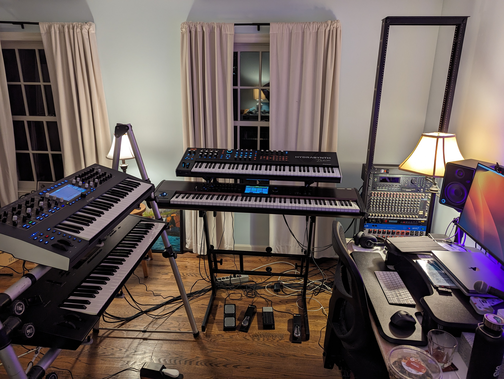
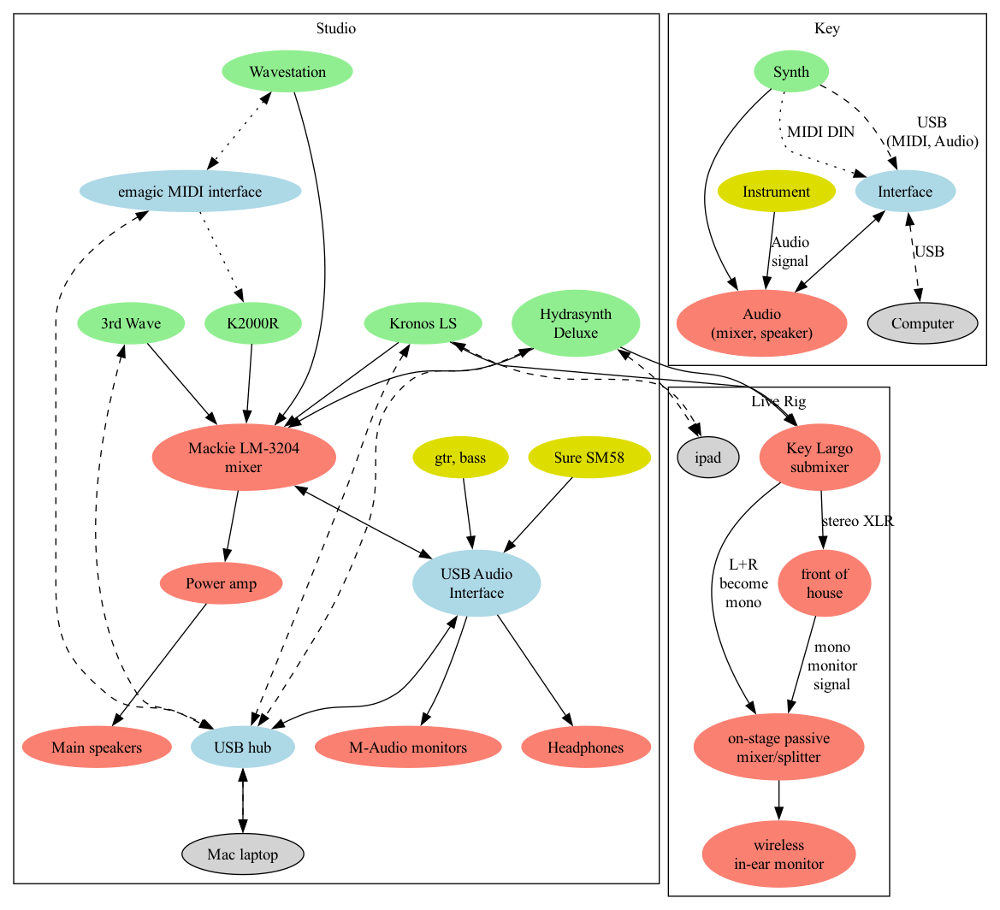

# Music

My first piano lesson was the day before my fifth birthday. I often combine
computers and music, like in my live performance software
[KeyMaster](https://github.com/jimm/keymaster) and its newer, more modern
sibling [JUCE KeyMaster](https://github.com/jimm/juce-keymaster). These
programs stem from an older program I wrote with the same name that I
originally wrote and ran on the Commodore 64 and used on stage for years. I
later ported it to the Atari ST, rewrote it for the now-defunct
[BeOS](https://en.wikipedia.org/wiki/BeOS), and wrote a Ruby version called
[PatchMaster](https://github.com/jimm/patchmaster/).

I play keyboards in [Ellis Island](http://ellisislandrock.com/), a cover
band based in Connecticut. Check out our [Spring 20204 demo
video](https://www.youtube.com/watch?v=Uf8QA3BE5fU).

I've been in [bands](#band-list) from circa 1975 to January 1993, went on a
hiatus, and started playing out again in 2013. Over the years, I've played
everything from progressive rock to dance pop to electric jazz and R&amp;B;
covers and originals.

I write different kinds of stuff. Most of it is funk/dance/pop, but I also
dabble in orchestral styles, Sondheim-esque pieces, game show themes,
thirty-second newsroom background music, and whatever else tickles my fancy.

Aside from the typeset pieces below and the sequencer and MIDI files of the
music I've done on my own, I have thrown a few things up on Soundcloud for
the fun of it --- none of it production quality. Out of all of the original
songs we did in the late '80's, I only have one crappy cassette of a bunch
of works-in-progress. It's dated but really good stuff. The sound quality
is horrendous. Also, the tape broke so I'll need to repair it one day and
digitize it.

My MIDI reference has moved [here](midi_ref.html). It's not a tutorial.
Rather, it is intended as a quick overview and a reference guide.

# Compositions

Here are three pieces I composed that I've typeset using
[LilyPond](http://lilypond.org/web/).

- [Equal Rites Main Theme](music/main_theme_piano.pdf)
- [Equal Rites Number 3](music/equal_rites_3.pdf)
  - Recording is called [At Sea](https://soundcloud.com/jim-menard/at-sea)
    on Soundcloud
- [Mosquito Bite Rag](music/mosquito_bite_rag.pdf)

Here are a few of the other songs on my
[SoundCloud page](https://soundcloud.com/jim-menard):

- [Delicate](https://soundcloud.com/jim-menard/delicate) from Equal Rites
- [No Fences](https://soundcloud.com/jim-menard/no-fences-draft) (draft)
- [Solar Power](https://soundcloud.com/jim-menard/solar-power) (draft)

# Equipment Collection

Here's what my home "studio" looks like in 2023. Since then, the Iridium has
been sold. When I play live I take the Kronos and the Hydrasynth.

Here's the schematic for my home studio and my live rig.

## Equipment List

- [Korg Kronos LS 88](https://www.korg.com/us/products/synthesizers/kronos2_ls/)
- [ASM Hydrasynth Deluxe](https://www.ashunsoundmachines.com/hydrasynth-deluxe)
- [Korg Wavestation](https://en.wikipedia.org/wiki/Korg_Wavestation)
- A big honking seven-foot rack, affectionately called the "Think Tank".
  Most of the equipment in it was originally mounted in a homemade, rolling,
  chest-high rack of the same name, along with a Commodore 64 running my own
  real time MIDI performance software.
  - Kurzweil K2000RS (R = rackmount, S = sampling), the rackmount version of
    [this](https://en.wikipedia.org/wiki/Kurzweil_K2000)
  - [Mackie LM-3204](https://gearsource.com/stock-item/mackie-lm3204-16-stereo-channel-32-mono-console/)
    mixer
  - Emagic AMT8 MIDI interface
  - Korg DRV-2000 digital reverb
  - Crest Audio FA901 power amp
  - Two rack-mount power strips
  - Custom patch bay with 12 1/2", 6 MIDI, 4 XLR, 2 1/2" TRS
  - Sedna 13 port rack mount USB hub
  - Akai ME10D MIDI "digital delay" (echoes MIDI data, optionally
    transposing it up/down one octave)
- Yamaha MV802 mixer, which used to be in the Think Tank. It's a backup
  stage submixer, so it's in a two-space rack gig bag.
- Things with strings:
  - Fender Stratocaster
  - Yamaha FG830 Acoustic Guitar
  - Ibanez SR505 5-string bass
  - [Chapman Stick](http://stick.com/), 12-string Grand Stick with 5 bass, 7
    treble strings; classic tuning
- Line 6 XH Stomp XL for the Strat
- Behringer U-PHORIA UMC404HD audio interface
- M-Audio MIDISPORT 4x4 Anniversary Edition 4-in/4-out USB MIDI Interface
- Radial Key Largo keyboard mixer, USB interface, and performance pedal
- ART SPLITMix4 passive splitter/mixer
- MEE Audio MX2 in-ear monitors
- Xvive U4 in-ear wireless system
- iPad on which I run [Midiflow](https://www.midiflow.com/) and
  [BandHelper](https://bandhelper.com/) (more info below)
- Apple MacBook Pro laptop
- [Moog Etherwave Theremin](https://www.moogmusic.com/synthesizers?type=54)
- [Akai MPD32](https://www.akaipro.com/mpd32) USB/MIDI pad controller

- Speakers:
  - A pair of Mackie CR-X5 powered monitors
  - JBL EON 515XT powered speaker
  - Mackie SRM150 150W 5.25 inch powered speaker
  - OAP T-122B wedge (70 lbs, a pain to carry around)
  - Secondhand home-made (by someone else) 12" + horn
- Guitar/Bass Amps:
  - Line 6 LowDown LD400 Pro (2x10" + horn)
  - Fender Frontman 15R practice amp that I found at the town dump in
    full working condition
- On-Stage KS7365EJ Pro Heavy-Duty Folding-Z Keyboard stand (two tier)
- Various Ultimate keyboard stands
- An Ultimate speaker stand
- Three empty six-space racks from the olden days of live performance
- Also hanging around
  - Yamaha U3 upright piano (in a different room)
  - Ukelele
  - Mandolin

## Live Rig

Here's what I use when I play live with [Ellis
Island](https://ellisislandrock.com/). Everything here is from the above
equipment list. You can see it in action
[here](https://www.youtube.com/watch?v=MN8Sgid2x30), though that video was
made before I started hooking up the synths with MIDI.

- Korg Kronos, sustain pedal, expression pedal used for volume, switch used
  for Leslie simulation speed
- ASM Hydrasynth Deluxe, sustain pedal, expression pedal (optional)
- On-Stage stand for the keyboards
- Fender Stratocaster
- Audio
  - Line 6 XH Stomp XL for the strat
  - Key Largo mixer providing stereo XLR or 1/4" to the house
  - MEE Audio MX2 in-ear monitors (IEM)
  - Xvive U4 in-ear wireless system
- MIDI
  - iPad using an Apple Camera (USB data to Thunderbolt) adapter to connect
    to a USB hub or a cable (see the next item)
  - One of these, depending on my mood
    - All USB (default)
      - USB cables from the Kronos and the Hydrasynth USB B outputs into the hub
      - Hub plugs into the iPad; iPad acts as the hub host
    - 5-pin DIN between synths, USB from iPad to Kronos to send prog
      changes. This is a backup in case the iPad dies
  - The iPad is running [Midiflow](https://www.midiflow.com/) and
    [BandHelper](https://bandhelper.com/)
    - Midiflow routes the MIDI between the Kronos and the Hydrasynth when
      I'm using the USB hub. I also use it to filter out clock messages in
      both directions and and modify the velocity curve when going from the
      Hydrasynth to the Kronos
    - BandHelper sends MIDI program changes to the Kronos which is in set list
      mode
    - I have the Kronos combinations for each song send program changes to
      the Hydrasynth and the HX Stomp XL when needed
- Optional / Rare
  - Ibanez bass (only for the few gigs where I've had to sub for the bass
    player)
  - Line 6 amp for the bass

I've dabbled with WIDI (Bluetooth MIDI) but had some latency problems that
must be caused by the way I was routing things. If I just set up WIDI
between the two synths everything works fine, but when I introduce the iPad
with Midiflow and BandHelper, there's a delay when I use the Hydrasynth to
play the Kronos. So I don't do that.

## Software List

- [BandHelper](https://bandhelper.com/).

- [Midiflow](https://www.midiflow.com/) for the iPad.

- [REAPER](http://reaper.fm/) Digital Audio Workstation (DAW).

- [KeyMaster](https://github.com/jimm/keymaster/wiki), real-time MIDI
  performance software that I wrote. The first incarnation was also called
  [KeyMaster](projects/keymaster/index.html). I used that version live from
  1986&ndash;1993. It was first written for the Commodore 64, later ported
  to the Atari ST. I half-heartedly started a Macintosh version. The next
  was the BeOS version, then a Ruby version
  ([PatchMaster](https://github.com/jimm/patchmaster/)), next
  [keymaster_objc](http://jimm.github.io/keymaster_objc/), a Mac OS X-only
  simpler version, and finally the cross-platform GUI version written in C++
  using wxWidgets ([KeyMaster](https://github.com/jimm/keymaster/wiki)).
  
- [Kronut](https://github.com/jimm/kronut), a set list slot text editor for
  the Kronos. It's software I wrote that lets me use my editor (Emacs) to
  edit single set list slot descriptions and entire set lists.

- ASM's Hydrasynth Patch Manager and Firmware Updater
  ([download page](https://www.ashunsoundmachines.com/downloads))

- [Korg KRONOS Editor](https://shop.korg.com/kronosSupport)
  (link is to the KRONOS support/downloads page). I've had troubles using
  this editor; the design it uses for edit space / memory is extremely
  confusing and I've more often erased / ruined set lists than successfully
  edited them.

- Apple's [MainStage 3](http://www.apple.com/mainstage/) was useful when I
  play with friends. We used to rent a rehearsal room once a week or so, and
  though the keyboards are the same in the different rooms we rent it was
  nice to have the same sounds, splits, transposes, etc. with me on my
  laptop.

- [MidiPipe](http://www.subtlesoft.square7.net/MidiPipe.html) MIDI munger.

- [LilyPond](http://lilypond.org/web/) for music notation typesetting.

## Old Gear

Just for fun, here's a list of all of the other gear I've owned throughout
the years. I started playing in bands in the late '70's. Here's what I
remember:

- Alesis D4 drum synth
- Alesis HR-16 drum machine
- Alesis SR18 drum machine
- Alesis MMT-8 hardware sequencer
- ASM Hydrasynth Keyboard (49-key)
- Commodore SX-64 running first Moog's Song Producer software, then
  my KeyMaster software
- Conn trumpet
- Ensoniq Mirage rack-mount sampler (loaded sounds from 3.5&quot; floppies!)
- Farfisa organ
- Fender Rhodes
- Groove Synthesis 3rd Wave
- Hohner International "electronic piano" (I think it was the International)
  from the late 1960's &mdash; my first keyboard after my parents' piano
- Korg wavestate
- Korg CX3 organ
- Korg Kronos 88 X (I sold that and changed to the LS which is much lighter)
- Korg Poly-61
- Korg Delta
- Kurzweil 1000PX
- Kurzweil Midiboard _Limited Edition_
- Moog Memorymoog Plus
- Moog Song Producer (software + MIDI interface)
- Moog Source
- Opcode Studio 5 MIDI interface
- Roland AXIS-1 strap-on MIDI keyboard
- Roland Juno 106
- Roland MKS-80 SuperJupiter
- Studiologic Sledge 2.0
- Waldorf Iridium 49-key
- Yamaha CP-80 electric grand (it was the singer's, but I got to use it)
- Yamaha CS-10 mono analog synth (or was it a CS-5?)
- Yamaha DX7
- Yamaha RX5 drum machine
- Yamaha TX81Z (Two of 'em. You could set the text to display when they
  powered up. I had the two of mine say `Welcome to the` / `Think Tank!`)

# Band List

Here are the bands and orchestras I've played in over the years, in reverse
chronological order. Believe me, you've never heard of any of them.

- [Ellis Island](http://ellisislandrock.com/) (keyboards, some guiter,
  rarely bass)
  - Our [2022 demo video](https://www.youtube.com/watch?v=MN8Sgid2x30)
- [Miles...](https://www.youtube.com/watch?v=t5yU0mX-u4w) (keyboards)
- Uncommon Ground (keyboards)
- Optional Stop (keyboards)
- Boys With Toys (keyboards)
- Shy264 (keyboards)
- Perfect Stranger (keyboards)
- Artisan (keyboards)
- Sinequanon (keyboards)
- Guys and Dolls (conductor and music director, college)
- Camelot (conductor and music director, high school)
- King Lizard Revival Jass Band (trumpet) _("Jass" is an early spelling of
  "Jazz")_
- Once Again (electric piano, trumpet, high school)
- Just Once (electric piano, trumpet, high school)
- All-State band, orchestra, jazz band in high school; One year, both
  orchestra (contrabass) and jazz band (electric piano)
- RI Youth Orchestra (contrabass, junior high, high school)
- Central Jr. High and East Providence High School concert and marching
  bands (trumpet)
- Starfire (electronic piano, junior high)
